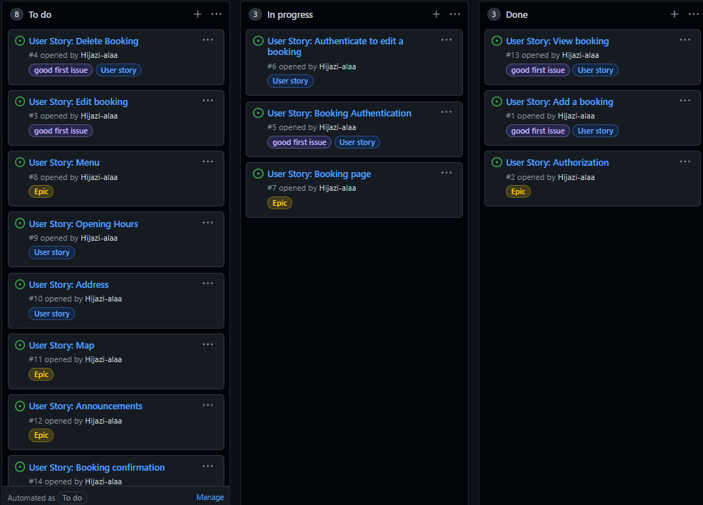
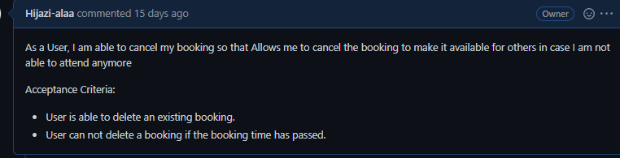

# Sea Side Restaurant

## [Sea Side](https://seaside-rest.herokuapp.com/)

 

This is a restaurant app that allows users to book a table at a certain time,
the site owner or admin can approve or dismiss the bookings.  
The site also has a menu page where Admin can add, edit, or delete menu items for visitors to see.  

<ul>
Technologies and libraries used:
<li>Python</li>
<li>Django.</li>
<li>Bootstrap</li>
<li>HTML/CSS</li>
<li>JavaScript</li>
<li>Cloudinary-storage</li>
<li>PostgreSQL</li>
</ul>
Sea Side consists of 3 separated apps: reservation, menu and announcement

Additionally, the admin can use the admin panel to publish new events and announcements wish then displayed in a section called announcements on the home page.  
Provided with Django's built-in user model, the app requires users to register or log in in order to create a booking, edit their own existing booking, or even delete their bookings. Bookings are only available to see for the user that created them.

The application is fully responsive on all devices.

Sea Side Restaurant is a full-stack application developed using agile methodology.
below are the issues that were defined before starting the applications with acceptance criteria

### mock up
I created a mock up of the home page using [Figma.com](https://www.figma.com/)

Worth to know that changes made to the homepage design while developing.

## Features 

Through out development, I followed the issues' acceptance criteria on every issue

### stage 1

#### User Story View booking

#### User Story Add a booking

#### User Story Booking confirmation

#### User Story Authorization

### stage 2

#### User Story Booking page

#### User Story Booking Authentication

#### User Story Authenticate to edit a booking

### stage 3

#### User Story Delete Booking

#### User Story Edit booking

#### User Story Oppening Hours

### stage 4

#### User Story Menu

#### User Story Address 

#### User Story Announcements

#### User Story Map

### Other Features

<ul>
<li>Navbar contains a restaurant's logo and links to all relevant pages, Booking only appears for logged-in users, instead, a none logged-in user would see a sign-up and sign-in links</li>
  

<li>The hero image on the home page contains 2 buttons 1 for creating a booking, that redirects non logged-in users to log in first in order to book.</li>
 

 

<li>View menu button available to all visitors.</li>

<li>About us section on the home page showcase the restaurant's services.</li>

<li>Google map API provided on the home page showing the location of the restaurant.</li>

<li>Menu page provided with an introduction of Kitchen chefs with social media links for each chef.</li>
 

 

<li>Feedback provided to all users actions in the form of messages, messages will disappear after 3 seconds of appearing.</li>

<li>Responsive footer at the bottom of every page, provided with social media links.</li>
 

 
</ul>

### Potential features to implement:
<ul>
<li>Ability for admin to change opening hours.</li>
<li>Check availability of tables and auto accept bookings according to it.</li>
</ul>

## Testing

<ul>Manual Testing:
<li>Booking data model tested: all of its CRUD functionality for the admin and users</li>
<li>Tested confirm bookings by admin.</li>
<li>Menu data model tested: create and read functionality for admin, and only view for users</li>
<li>Announcements data model: tested create and read functionality for the admin and only view for users</li>
<li>Sign-up/ Sign-in forms and links all tested to confirm working as intended</li>
<li>Tested Booking page links and all its functionality</li>
<li>Tested User Authorisations to ensure role-based functions such as Booking page access, edit or deleting bookings</li>
</ul>

### Validator Testing
<ul>
<li>All Python code ran through PEOP8 checker succesfully without any problem.</li>

<li>All CSS files ran through CSS jigsaw validator with no errors</li>

[CSS JIGSAW](https://jigsaw.w3.org/css-validator/) passed with no erros.

<li>All HTML files ran through W3C validator with no errors</li>

[HTML W3C validator](https://validator.w3.org/)
</ul>

## Deployment
At the start of making the project I the made the first deployment to Heroku after setting up the environment by doing the following steps:
<ol>
<li>Installing Django and supporting libraries</li>
    <ul>
        <li>Installed Django and gunicorn</li>
        <li>Installed supporting libraries</li>
        <li>Installed Cloudinary Libraries</li>
        <li>Created project and app</li>
        <li>Ran server to test</li>
    </ul>
<li>Deploying an app to Heroku</li>
    <ul>
    <li>Created an app on Heroku</li>
    <li>Attached the database</li>
    <li>Prepared environment and settings.py file</li>
    <li>Got my statc and media files stored on Cloudinary</li>
    <li>Deplyed the app (empty) by linking my Github and chose deploy branch.</li>
    </ul>
<li>Final deployment after finishing the project:</li>
    <ul>
    <li>Installed heroku in gitpod using the command: npm install -g heroku</li>
    <li>Logged in to heroku in the terminal window used command: login -i</li>
    <li>Entred command heroku git:remote -a seaside-rest to select the heroku app I created before remotly</li>
    <li>Added and commited all changes to github</li>
    <li>pushed to github and heroku using commands:
    <ul>
        <li>git push origin main</li>
        <li>git push heroku main</li>
    </ul>
    </li>
    </ul>
</ol>
End of deployment

## Credits

Hero Image was taken by a google search, Original site owner is:
https://www.ahusseaside.com/

Images of chefs and hero sections buttons style are taken from a boot strap template:

[Bootstrapmade](https://bootstrapmade.com/delicious-free-restaurant-bootstrap-theme/)

Html elemnts main responsivenes are [Bootstrap](https://getbootstrap.com/)

all icons used in the projects are [FontAwsome](https://fontawesome.com/)

Fonts from by [Google Fonts](https://fonts.google.com/)

Map API from [Google map platform](https://mapsplatform.google.com/)

Used the lessons videos of (I think therefore I blog) for reference on deployment and creating a model.

Recived help from Daniel_c_5p on slack in :
<ul>
<li>restrict booking views to the user that owns the booking</li>
<li>Help with menu view function to view menu items in 4 seperate categories</li>
</ul>

Code institute tutor support helped me get back on track on several occasions when I had errors or any problems throughout the project.